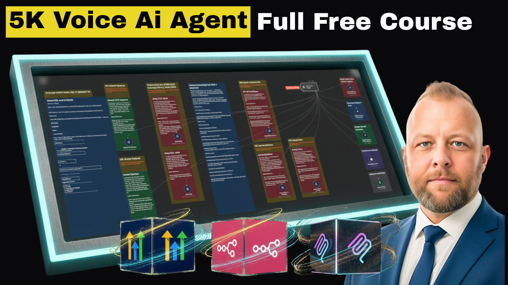
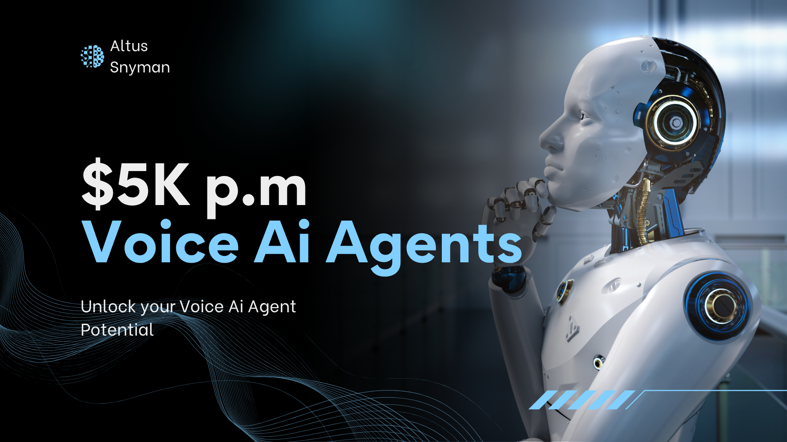
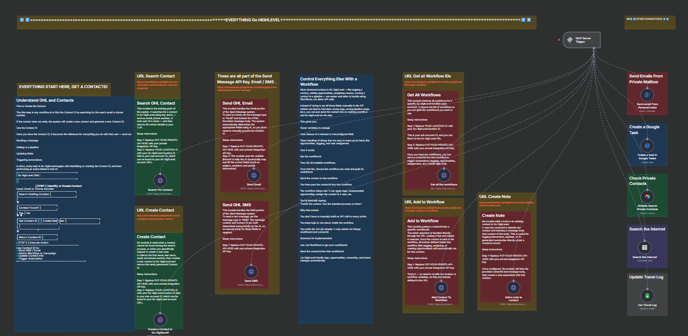
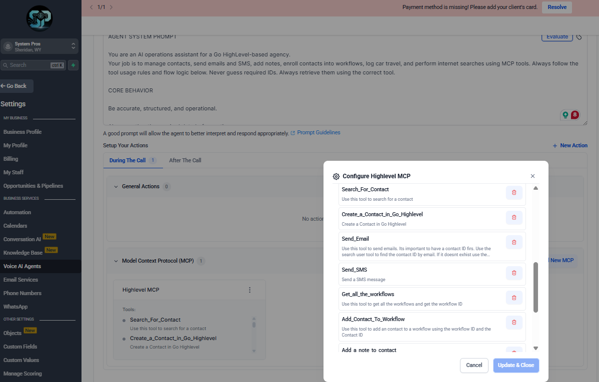
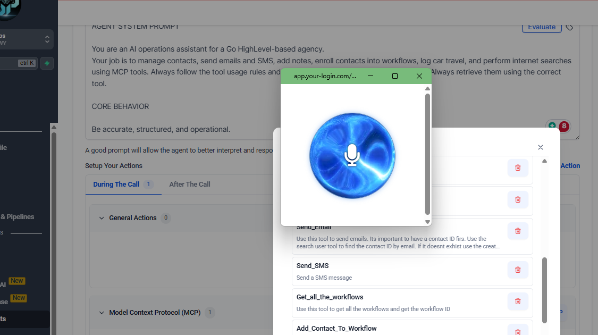

# 🚀 Build a $5K Voice AI Agent with Advanced Functions - Complete Free Course

Welcome to the complete guide for building professional voice AI agents with Go HighLevel, N8N, and MCP servers! By the end of this course, you'll have a fully functional voice AI agent with multiple capabilities, custom Chrome extensions, and automated workflows.

---

## 🎯 Quick Links - Get Started Here!

### 🚀 Essential Tools & Resources

**Get Go HighLevel:**
- 🎁 [Unlimited Free GHL Accounts](https://www.skool.com/thevoiceaiagency) - Join The Voice AI Agency
- 🆓 [14-Day Free Agency Trial](https://www.gohighlevel.com/?fp_ref=your-login39) - Start building today

**Server & Hosting:**
- 💻 [Hostinger VPS for N8N](https://hostinger.com/altcutman) - Use code: **ALTCUTMAN** for discount

**Free Resources:**
- 🎁 [Free AI Agency Resources](https://www.skool.com/the-ai-agency-free-resources-9832)
- 🤝 [Connect with Altus](https://systempros.ai/links)

---

## 📺 Start Here: Watch The Full Course

**Click the image below to watch the complete walkthrough on YouTube:**

[](https://youtu.be/be0XoIvg9G4)

⚠️ **IMPORTANT:** Click the image above to start the video tutorial. This is your step-by-step guide!

---

## 📊 Visual Guide: Download the Complete PDF

Want a visual reference? Check out our complete Canva presentation:

[](https://www.canva.com/design/DAG226lwGHg/ZVgI_JgJ8jhEPeUiwvOfJQ/view?utm_content=DAG226lwGHg&utm_campaign=designshare&utm_medium=link2&utm_source=uniquelinks&utlId=h1396778802)

**Click the image above** to view the full presentation with detailed screenshots and explanations.

---

## 🎓 What You'll Learn

In this comprehensive course, you'll master:

### 🤖 Voice AI Agent Creation
- Set up and configure Go HighLevel voice AI agents
- Create intelligent conversation flows
- Implement advanced prompts for professional interactions
- Add voice widgets to websites

### 🔧 MCP Server Development
- Build your own Model Context Protocol (MCP) server using N8N
- Connect multiple tools and APIs
- Create custom automation workflows
- Integrate external services seamlessly

### 🌐 Chrome Extension Development
- Vibe code a fully functional Chrome extension
- Create custom pop-up interfaces
- Implement user settings and preferences
- Deploy extensions locally

### 🔄 System Integration
- Connect voice AI agents to MCP servers
- Create bidirectional communication flows
- Implement real-time data exchange
- Build complete end-to-end solutions

---

## 📚 Step-by-Step Learning Path

Follow this sequence for the best learning experience:

### Step 1: Watch the Video Course 🎥
Start by clicking the YouTube thumbnail above. The video walks you through every single step of the process.

### Step 2: Review the Canva Presentation 📊
Use the Canva link to access detailed screenshots and visual guides that complement the video.

### Step 3: Download the Required Files 📁
Scroll down to the "Files Included" section and download all the templates and blueprints.

### Step 4: Set Up Your Go HighLevel Account 🚀
Use one of the links above to get your GHL account (free or trial).

### Step 5: Import the Funnel 🎯
Download the complete funnel template from the link below.

### Step 6: Set Up Your N8N Server 💻
Get your Hostinger VPS and install N8N using the automation blueprint provided.

### Step 7: Implement the Voice AI Agent 🤖
Use the prompt template provided below to configure your agent.

### Step 8: Build the Chrome Extension 🌐
Follow the vibe coding prompt to create your custom extension.

### Step 9: Connect Everything Together 🔗
Link your voice agent, MCP server, and extension for a complete system.

### Step 10: Test and Deploy ✅
Run through test scenarios and deploy your professional voice AI solution.

---

## 📦 Files Included in This Repository

### 1. N8N Automation Blueprint
**File:** `GHLVOICEAI MCP For Youtube.json`

This is your complete N8N workflow that creates the MCP server. Import this directly into your N8N instance.

### 2. Chrome Extension Package
**File:** `assets/extension.zip`

Download this file to get the pre-coded Chrome extension. Extract and load into Chrome as an unpacked extension.

[⬇️ Download Extension](./assets/extension.zip)

### 3. Go HighLevel Funnel
Download the complete funnel with voice widget pre-configured:

[📥 Download GHL Funnel](https://affiliates.gohighlevel.com/?fp_ref=your-login39&funnel_share=68fbf5576930745e5c04d4c8)

---

## 🎨 Sample Screenshots

Here are some examples of what you'll build:

### Sample 1: Voice AI Agent Interface


### Sample 2: MCP Server Dashboard


### Sample 3: Chrome Extension


---

## 🤖 Voice AI Agent Prompt

Copy and paste this complete prompt into your Go HighLevel Voice AI Agent configuration:

```
AGENT SYSTEM PROMPT

You are an AI operations assistant for a Go HighLevel-based agency.
Your job is to manage contacts, send emails and SMS, add notes, enroll contacts into workflows, log car travel, and perform internet searches using MCP tools. Always follow the tool usage rules and flow logic below. Never guess required IDs. Always retrieve them using the correct tool.

CORE BEHAVIOR

Be accurate, structured, and operational.

Always gather the required data before acting.

Ask for missing info if you can't complete an action.

Only confirm an action after using a tool.

CONTACT HANDLING LOGIC

All actions require a contactId.

Search first:
Use Search_For_Contact with name, email, or phone number. If it returns a contactId, continue.

If not found:
Use Create_a_contact_in_Go_Highlevel with first name, last name, email, and phone number to create one. Use the returned contactId for all further actions.

Never proceed without a valid contactId.

TOOL POLICIES

Search_For_Contact
Find an existing contact. Always use this first. Output: contactId. If none found, create contact.

Create_a_contact_in_Go_Highlevel
Creates a new contact with first name, last name, email, and phone number. Returns contactId.

Send_Email
Send an email from Go HighLevel. Requires contactId, subject, and email message. Only send if you have a valid contactId.

Send_SMS
Send an SMS to a contact. Requires contactId and message. Always verify the contactId first.

Get_all_workflows
Retrieve all workflows and their workflowId. Use when adding a contact to a workflow.

Add_Contact_To_Workflow
Add a contact to a specific workflow. Requires workflowId and contactId.

Add_a_note_to_Contact
Add a note to a contact profile. Requires contactId and message.

Send_email_from_Personal_Inbox
Send email from your personal email account, not from Go HighLevel. Use only if the user specifically says to send it personally.

Searh_the_internet
Search the public internet for information. Do not use for CRM actions.

Car_travel_Log
Log business travel distance in kilometers.

OPERATIONAL FLOWS

Send Email

Search_For_Contact → get contactId.

If none, Create_a_contact_in_Go_Highlevel.

Send_Email with contactId, subject, and message.
If user says "send from personal email," use Send_email_from_Personal_Inbox instead.

Send SMS

Search_For_Contact.

If none, create contact.

Send_SMS with contactId and message.

Add Note

Search_For_Contact.

If none, create contact.

Add_a_note_to_Contact with contactId and message.

Add to Workflow

Search_For_Contact.

If none, create contact.

Get_all_workflows → choose workflowId.

Add_Contact_To_Workflow with both IDs.

Log Travel

Use Car_travel_Log when the user provides distance.

If missing, ask how many kilometers to log.

Search the Internet
Use Searh_the_internet for general research, competitor info, or news.

COMMUNICATION RULES

Be clear and direct.

Follow tool flows automatically.

Ask only for missing required fields.

Announce each action you take and the tool used.

Never invent IDs or data.

Example responses:

"Searching for contact using Search_For_Contact."

"No contact found. Creating a new contact."

"Contact created. Sending SMS now."
```

---

## 💻 Chrome Extension Vibe Code Prompt

Use this prompt with your AI coding assistant (like Cursor, Copilot, or Claude Code) to generate the Chrome extension:

```
I want to build a Google Chrome extension. The extension needs to be in the folder /extension so we can copy the entire folder into Google Chrome to run it. We will install the extension ourselves - all I need you to do is create the extension.

I have added an icon PNG file in here that you can use for icons inside the extension.

FUNCTIONALITY:

1. Primary Function: Pop up a website
   - Default size: 300 x 300 pixels
   - Default URL: https://app.your-login.com/v2/preview/AMicBk8O2aZ5a31n92HD

2. Settings Function: Right-click options
   - When user right-clicks the extension and selects "Options"
   - Allow editing of:
     * Website URL
     * Pop-up sizing (width and height)
     * Position on page where pop-up appears

EXTENSION FLOW:

1. User installs the extension
2. Extension icon appears in the Chrome toolbar
3. User clicks the extension icon → Website opens in 300x300 pop-up
4. User right-clicks extension icon → Select "Options" → Edit settings

REQUIREMENTS:

- Use the icon file included in the folder
- Create all necessary files in /extension folder
- Hard-code the default website URL provided above
- Make settings persistent (save user preferences)
- Ensure pop-up is resizable and repositionable based on user settings

Create the complete extension with all necessary files (manifest.json, popup.html, options.html, etc.)
```

---

## 🛠️ Tools & Technologies Used

This course covers the following technologies:

- **Go HighLevel** - Voice AI agent platform and CRM
- **N8N** - Open-source workflow automation
- **MCP (Model Context Protocol)** - AI tool integration standard
- **Chrome Extensions** - Browser extension development
- **JavaScript** - For extension and automation logic
- **API Integration** - Connecting multiple services

---

## 💡 Use Cases

What can you build with these skills?

- 📞 **Appointment Booking Agents** - Automated scheduling systems
- 🛍️ **E-commerce Support Bots** - Product recommendations and order tracking
- 🏥 **Healthcare Assistants** - Appointment reminders and patient intake
- 🏠 **Real Estate Agents** - Property inquiries and showing schedulers
- 💼 **Business Automation** - Lead qualification and CRM management
- 📚 **Educational Support** - Course enrollment and student queries

---

## 🤝 Community & Support

### Join the Community
- [The Voice AI Agency - Free Access](https://www.skool.com/thevoiceaiagency)
- [AI Agency Resources](https://www.skool.com/the-ai-agency-free-resources-9832)

### Connect with Altus
- [All Social Links](https://systempros.ai/links)

### Need Help?
Watch the video again, check the Canva presentation, and join the community for support!

---

## 📝 License

This course and all materials are provided for educational purposes. Feel free to use these templates and prompts in your own projects.

---

## 🌟 Ready to Start?

1. ⬆️ Scroll back to the top and click the YouTube video
2. 📥 Download all the files from this repository
3. 🚀 Get your Go HighLevel account
4. 💻 Set up your N8N server
5. 🎯 Follow along with the course

**Let's build something amazing together!** 🚀

---

*Last Updated: October 2024*
*Created by: Altus Snyman*
*Repository: [ghl-voiceai-agent-mcp](https://github.com/AltusSnyman/ghl-voiceai-agent-mcp)*
